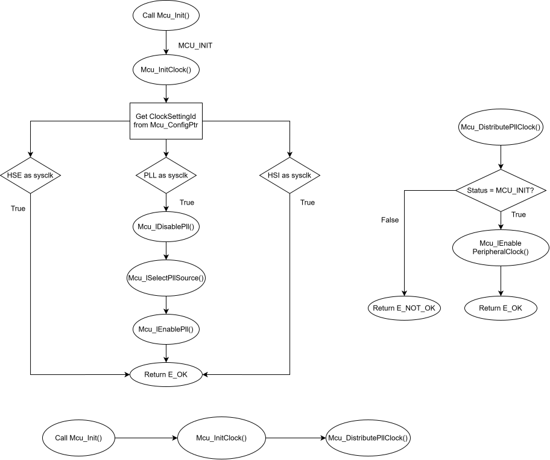

## Overview
MCU driver is responsible for:
- System clock configuration
- PLL initialization
- System clock switching
- Peripheral clock enabling
- Clock frequency calculation

## Features
- HSI clock support
- HSE clock support
- PLL configuration
- AHB/APB prescaler configuration
- System clock distribution
- Frequency calculation APIs

## Public APIs

| API                       |                                  Description                                |
|-----                      |-----------------------------------------------------------------------------|
| Mcu_Init                  | Initialize MCU module                                                       |
| Mcu_InitClock             | Configure clock source                                                      |
| Mcu_GetPllStatus          | Get PLL lock status                                                         |
| Mcu_DistributePllClock    | Switch system clock                                                         |
| Mcu_GetSysClkFreq         | Get SYSCLK frequency                                                        |
| Mcu_GetHclkFreq           | Get HCLK frequency                                                          |
| Mcu_GetPclk1Freq          | Get APB1 frequency                                                          |
| Mcu_GetPclk2Freq          | Get APB2 frequency                                                          |

## Initialization Flow

Flow khởi tạo thực tế của MCU là : Application -> Mcu_Init() -> Mcu_InitClock() -> Mcu_DistributePllClock

- Mcu_Init() lưu con trỏ cấu hình đánh dấu driver đã được khởi tạo sau khi chạy 
    Mcu_ConfigPtr = ConfigPtr;
    Mcu_Status = MCU_INIT;
lúc này MCU_UNINIT -----> MCU_INIT chưa cấu hình clock gì cả

- Mcu_InitClock() đây mới là hàm cấu hình clock chính
    Kiểm tra module đã init chưa
    Kiểm tra clock setting
    Lấy cấu hình clock từ con trỏ ConfigPtr và ClockId tương ứng
    Chọn nguồn clock

- Mcu_DistributePllClock()
    Sau Mcu_InitClock():    PLL : ON
                            PLL : LOCKED
                            SYSCLK : vẫn là HSI
    Chỉ khi gọi Mcu_DistributePllClock() thì sysclk mới switch sang PLL thật sự