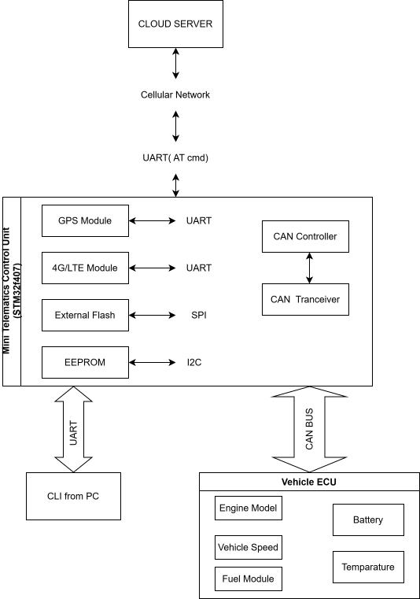

# System Requirements Specification (SRS)

---

Project Name : Mini Telematics Control Unit (Mini TCU)

Version : 0.1

Status : Draft

Author : Nguyen Minh Tuan

---

# Revision History

| Version | Date | Description |
|----------|------------|--------------------------|
|0.1|YYYY-MM-DD|Initial Draft|

---

# Table of Contents

1. Introduction
2. Overall Description
3. Functional Requirements
4. Non-functional Requirements
5. External Interfaces
6. System Constraints
7. Assumptions
8. Future Enhancements

---

# 1. Introduction

## 1.1 Purpose

The Mini Telematics Control Unit (Mini TCU) is an embedded automotive system designed to acquire vehicle information through the CAN bus, obtain positioning data from a GNSS receiver, store telemetry data locally during network outages, and periodically upload collected information to a cloud platform through a cellular modem.

This project is developed as an AUTOSAR-inspired embedded firmware platform to demonstrate modular firmware architecture, communication stack implementation, embedded software design, and real-time system development.

---

## 1.2 Scope

The project includes:

- Vehicle data acquisition
- GNSS positioning
- Cellular communication
- Offline data logging
- Cloud communication
- Remote configuration
- Bootloader support
- Diagnostic interface
- Event logging

The project does NOT include:

- Vehicle control
- ADAS
- Functional Safety
- AUTOSAR RTE Generator
- AUTOSAR OS

---

## 1.3 Definitions

| Abbreviation | Description |
|-------------|-------------------------------|
|ECU|Electronic Control Unit|
|TCU|Telematics Control Unit|
|GNSS|Global Navigation Satellite System|
|CAN|Controller Area Network|
|CLI|Command Line Interface|
|OTA|Over-the-Air Update|
|MCAL|Microcontroller Abstraction Layer|
|COM|AUTOSAR Communication Module|
|PDU|Protocol Data Unit|

---

# 2. Overall Description

## 2.1 Product Perspective

Mini TCU communicates with:

- Vehicle ECU
- GNSS Module
- Cellular Modem
- External Flash
- EEPROM
- Cloud Platform
- Debug PC

The system continuously acquires vehicle status, determines vehicle location, stores telemetry data, and uploads information to the cloud.

---

## 2.2 Product Functions

The system shall provide:

- CAN communication
- GPS positioning
- Cellular communication
- Cloud upload
- Offline storage
- Configuration management
- Event logging
- Firmware update
- Diagnostic CLI

---

## 2.3 Operating Environment

Hardware

- STM32F407
- SIM7600
- GNSS Receiver
- CAN Transceiver
- External SPI Flash
- I2C EEPROM

Software

- Bare Metal
- FreeRTOS (optional)

---

# 3 Functional Requirements

---

## Vehicle Communication

### FR-001

The system shall initialize the CAN controller.

---

### FR-002

The system shall receive CAN messages.

---

### FR-003

The system shall transmit CAN messages.

---

### FR-004

The system shall decode predefined CAN signals.

---

### FR-005

The system shall detect CAN communication timeout.

---

## GNSS

### FR-006

The system shall initialize the GNSS receiver.

---

### FR-007

The system shall acquire

- Latitude
- Longitude
- UTC Time
- Vehicle Speed
- Number of Satellites

---

### FR-008

The system shall determine GNSS Fix status.

---

### FR-009

The system shall report GNSS communication failure.

---

## Cellular Communication

### FR-010

The system shall initialize the cellular modem.

---

### FR-011

The system shall register to the cellular network.

---

### FR-012

The system shall establish a connection to the cloud server.

---

### FR-013

The system shall periodically upload telemetry data.

---

### FR-014

The system shall reconnect automatically after communication failure.

---

## Data Logging

### FR-015

The system shall store telemetry data into external flash when network communication is unavailable.

---

### FR-016

The system shall upload buffered data after network recovery.

---

### FR-017

The system shall implement circular storage management.

---

## Configuration

### FR-018

The system shall store configuration parameters inside EEPROM.

---

### FR-019

The system shall restore configuration after reset.

---

### FR-020

The system shall support remote configuration.

---

## Diagnostics

### FR-021

The system shall provide UART CLI.

---

### FR-022

The system shall display system information.

---

### FR-023

The system shall support diagnostic commands.

---

## Logging

### FR-024

The system shall record system events.

---

### FR-025

The system shall classify log levels.

- INFO
- WARNING
- ERROR

---

## Bootloader

### FR-026

The system shall support firmware update.

---

### FR-027

The system shall verify firmware integrity using CRC.

---

### FR-028

The system shall jump to the application after successful verification.

---

## Watchdog

### FR-029

The system shall periodically refresh the watchdog timer.

---

### FR-030

The system shall recover automatically after watchdog reset.

---

# 4 Non-functional Requirements

---

## Performance

### NFR-001

CAN message processing latency shall be less than 2 ms.

---

### NFR-002

GNSS update rate shall be 1 Hz.

---

### NFR-003

Telemetry upload interval shall be configurable.

---

### NFR-004

CLI response time shall be less than 100 ms.

---

## Reliability

### NFR-005

No telemetry data shall be lost during temporary network outages.

---

### NFR-006

The system shall recover automatically after unexpected reset.

---

### NFR-007

The system shall tolerate temporary cellular communication failures.

---

## Resource Usage

### NFR-008

CPU utilization shall remain below 70%.

---

### NFR-009

RAM utilization shall remain below available memory.

---

### NFR-010

Flash utilization shall remain below available memory.

---

## Maintainability

### NFR-011

Firmware shall follow AUTOSAR-inspired layered architecture.

---

### NFR-012

Each software module shall have clearly defined interfaces.

---

### NFR-013

All software modules shall be independently testable.

---

# 5 External Interfaces

## CAN Interface

Communication with Vehicle ECU

Bitrate

500 kbps

Protocol

CAN 2.0A

---

## GNSS Interface

UART

NMEA0183

9600 bps

---

## Cellular Interface

UART

AT Commands

115200 bps

---

## Flash Interface

SPI

---

## EEPROM Interface

I2C

---

## Debug Interface

UART

115200 bps

CLI

---

# 6 System Constraints

- MCU: STM32F407
- CAN 2.0
- UART communication
- External Flash storage
- External EEPROM
- Embedded C Language
- AUTOSAR-inspired architecture

---

# 7 Assumptions

- Vehicle ECU periodically broadcasts CAN frames.
- Cellular network coverage is available.
- GNSS antenna has sufficient satellite visibility.
- External Flash and EEPROM are operational.

---

# 8 Future Enhancements

Future versions may support:

- OTA Firmware Update
- TLS Encryption
- CAN FD
- UDS Diagnostic
- Multiple CAN Channels
- Ethernet
- MQTT over TLS
- Secure Boot
- SD Card Storage
- Vehicle Health Monitoring

---

End of Document
