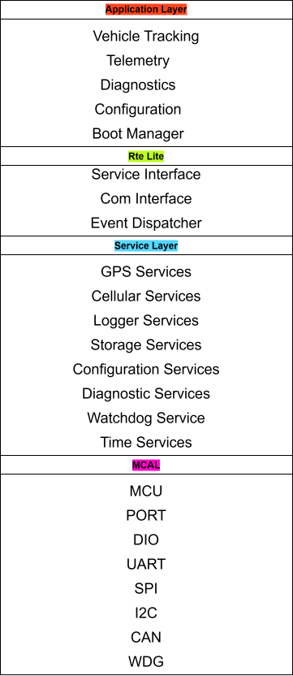

# Software Architecture Document

---

Project Name : Mini Telematics Control Unit

Version : 0.1

Status : Draft

Author : Nguyen Minh Tuan

---

# Table of Contents

1. Introduction
2. Design Principles
3. Layered Architecture
4. Software Components
5. Communication Flow
6. Task Model
7. Memory Organization
8. Error Handling

---

# 1 Introduction

This document describes the software architecture of the Mini Telematics
Control Unit.

The software follows an AUTOSAR-inspired layered architecture while keeping
the implementation lightweight and suitable for educational and personal
projects.

---

# 2 Design Principles

The software architecture shall satisfy the following principles.

- Layered architecture
- Low coupling
- High cohesion
- Hardware abstraction
- Modular design
- Configurable modules
- Reusable software components

---

# 3 Software Layer

The firmware is divided into five layers.

Application Layer

↓

Service Layer

↓

Communication Stack

↓

MCAL

↓

Hardware

---

---

## 3.1 Application Layer

Responsible for system behaviors.

Modules

- Vehicle Tracking
- Telemetry
- Diagnostics
- Configuration
- Boot Manager

The Application Layer shall never access hardware directly.

---

## 3.2 Service Layer

Provide reusable services.

Modules

- Logger
- Scheduler
- Flash Manager
- EEPROM Manager
- GPS Manager
- Cellular Manager
- Watchdog Manager
- CLI
- Time Service

---

## 3.3 Communication Stack

Responsible for communication abstraction.

Modules

- COM
- PduR
- CanIf
- Can Driver

The Application Layer communicates only through COM.

---

## 3.4 MCAL

Responsible for hardware abstraction.

Modules

- Mcu
- Port
- Dio
- Gpt
- Wdg
- Uart
- Spi
- I2c
- Can
- Fls
- Eep

---

## 3.5 Hardware

- STM32F407
- CAN Peripheral
- UART
- SPI
- I2C
- Flash
- EEPROM
- SIM7600
- GNSS

---

# 4 Software Components

## Vehicle Tracking

Responsibilities

- Collect GPS
- Collect Vehicle Speed
- Collect Engine RPM
- Build Telemetry Packet

---

## Telemetry

Responsibilities

- Packet Builder
- Message Queue
- Upload Scheduler

---

## Flash Manager

Responsibilities

- Store Data
- Read Data
- Circular Buffer
- Data Recovery

---

## Logger

Responsibilities

- INFO
- WARNING
- ERROR

---

## Configuration Manager

Responsibilities

- Read Configuration
- Save Configuration
- Default Configuration

---

## GPS Manager

Responsibilities

- Parse NMEA
- GPS State
- Fix Detection

---

## Cellular Manager

Responsibilities

- AT Commands
- MQTT
- HTTP
- Reconnect

---

## CLI

Responsibilities

- Diagnostic
- Configuration
- Debug

---

# 5 Communication Flow

Vehicle ECU

↓

CAN Driver

↓

CanIf

↓

PduR

↓

COM

↓

Application

---

GPS

↓

UART Driver

↓

GPS Manager

↓

Application

---

SIM7600

↓

UART Driver

↓

Cellular Manager

↓

Application

---

Flash

↓

SPI Driver

↓

Flash Manager

↓

Application

---

# 6 Task Model

The firmware uses cooperative scheduling or FreeRTOS.

Main Tasks

Vehicle Task

Period

10 ms

---

GPS Task

100 ms

---

CAN Task

5 ms

---

Telemetry Task

1000 ms

---

Logger Task

100 ms

---

CLI Task

10 ms

---

Watchdog Task

500 ms

---

# 7 Memory Organization

Flash

Bootloader

↓

Application

↓

Configuration

↓

Log Storage

External Flash

Circular Buffer

Telemetry Log

EEPROM

Configuration

Device ID

Server Address

Upload Interval

---

# 8 Error Handling

System errors are classified into three levels.

INFO

Normal events.

WARNING

Recoverable failures.

ERROR

Critical failures requiring system recovery.

All errors shall be recorded by Logger.

---

End of Document